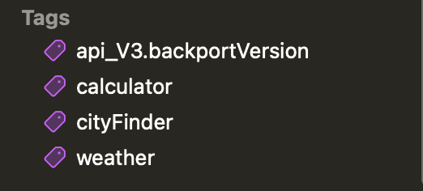
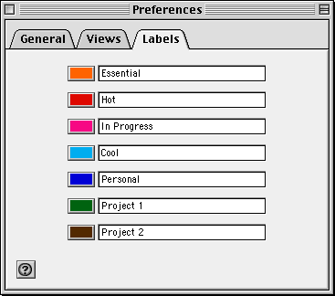

# @Tag

Помимо группировки с помощью типов данных, ты можешь группировать отдельные функции или целые типы данных с помощью тегов.

> Тег — это ассициированное ключевое слово, относящееся к типу данных или отдельным функциям или методам.

Цель тега — объединить и классифицировать данные по одному или нескольки ключевым словам.
Вначале книги ты уже ознакомился с тегами и знаешь зачем они нужны.

Данная глава включает в себя:

1. [Добавление тега в проект](#Добавление-тега-в-проект)
2. [Ошибки добавления тега](#Ошибки-добавления-тега)
3. [Цвет тега](#Цвет-тегов)

По мере роста проекта или отдельного пакета количество тестов может вырости до сотни или тысячи. Некоторые из этих тестов могут пересекаться, т.е. иметь общие свойства или относится к одной и той же категории. Swift Testing имеет из коробки макрос `@Tag`
с помощью которого можно группировать тесты.

По смысловому значению макрос @Tag отличается от @Suite. @Suite применяется к типам данных, а теги предоставляют семантическую информацию, которая может быть общей для любого количества тестов, исходных файлов или таргетов.

### Добавление тега в проект

Для такой группировки используем трейт `.tag(...)`, который ты встречал ранее в книге.
Если тег применен к типу данных в макросе `@Suite`, то все методы будут сгруппированны соответсвующим тегом.

> [!NOTE]
> Следует отменить, что применение тегов происходит в runtime.

Сами по себе теги являются экземплярами структуры `Tag`. Для добавления собственного тега в проект необходимо сделать расширение данной структуры:

```swift
extension Tag {
	/// Все, что связано с калькулятором
	@Tag
	static var calculator: Self
}
```

В расширении мы объявляем статическое свойство, указывающее на этот же тип и применяет макрос `@Tag`. Сам по себе макрос @Tag не принимает никаких параметров.

> [!IMPORTANT]
> Библиотека тестирования не присваивает никакого семантического значения тегам. Наличие или отсутствие тегов не влияет на то, как библиотека тестирования выполняет тесты.

Иногда возникает ситуация, когда имя тега уже используется в другом таргете или файла.
В таком случае ты можешь использовать `reverse-DNS` именование для создания уникального имени:

```swift
extension Tag {
	enum api_V3 {}
}

extension Tag.api_V3 {
	@Tag
	static var backportVersion: Tag
}
```

Вызови следующим образом:

```swift
@Suite("Unsupported API V3", .tags(.api_V3.backportVersion))
struct BackportedAPI {
	@Test
	func fetchMainRoute() async throws {
		// ...
	}
}
```

### Ошибки добавления тега

Теги должны быть объявлены **только в расширении структуры** `Tag`:

```swift
extension Tag {
	@Tag
	static var calculator: Self // ✅ OK: Создали новый тег

	@Tag
	static let

	static var programmerCalculator: Self // ❌ Ошибка: тег не распознан в runtime

	static var devCalculator: Self { // ❌ Ошибка: тег не распознан в runtime
		calculator
	}
}
```

Другим сценарием служит глобальное объявление, которое так же не поддерживается:

```swift
@Tag
let featureRelease: Self // ❌ Ошибка: Тег должен быть объявлен в расширении Tag, а не глобально

@Suite
struct SingleProfile {
	@Tag
	var onlySingleProfile: Self // ❌ Ошибка: Тег должен быть объявлен в расширении Tag, а не в типе данных
	// ...
}
```

### Цвет тегов

После добавление тега, в панели навигации виден его цвет.
Xcode предоставляет <u>только один цвет</u> — фиолетовый.



Для вывода в терминале, библиотека тестирования предоставляет следующие цвета для команды `swift test`:

1. Красный
2. Оранжевый
3. Желтый
4. Зеленый
5. Синий
6. Фиолетовый

Стоит упомнять о забавном факте в истории Apple.
Инженеры Apple используют цвета из оригинальной ОС System 7 (1991 г, позже назвали Mac OS 7), поэтому если ты сделал тег одним из имен ниже, то при вызове команды `swift test` цвет тега изменится.


```swift
extension Tag {
  @Tag
  static var essential: Self
}

@Test(.tags(.essential))
func showTestName() {
  #expect(Test.current?.displayName == nil)
}
```



> [!NOTE]
> Изменение цвета тега не касается Xcode, поскольку эта [функция эксперементальная][github_issue].

[github_issue]: https://github.com/swiftlang/swift-testing/issues/985
