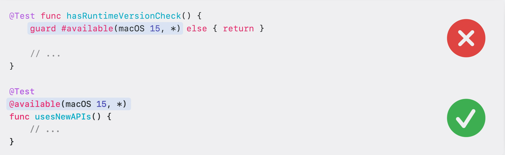
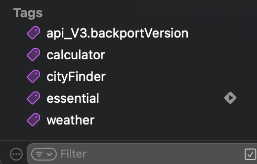
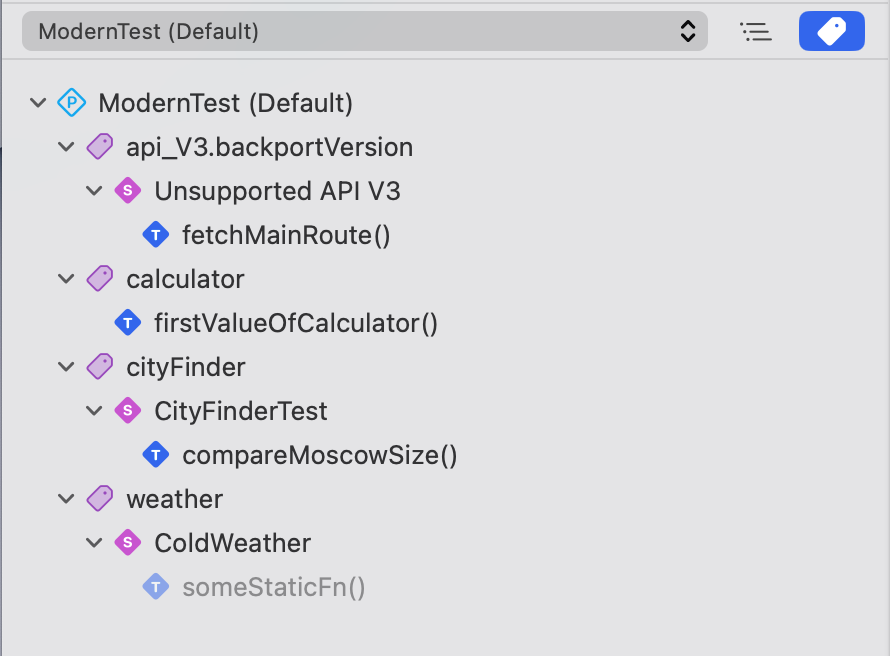
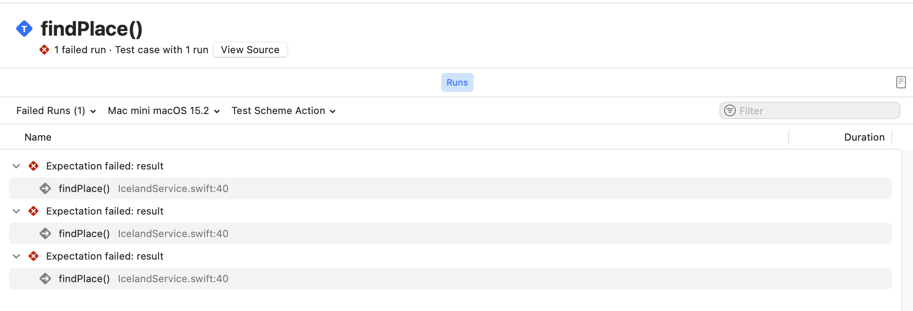
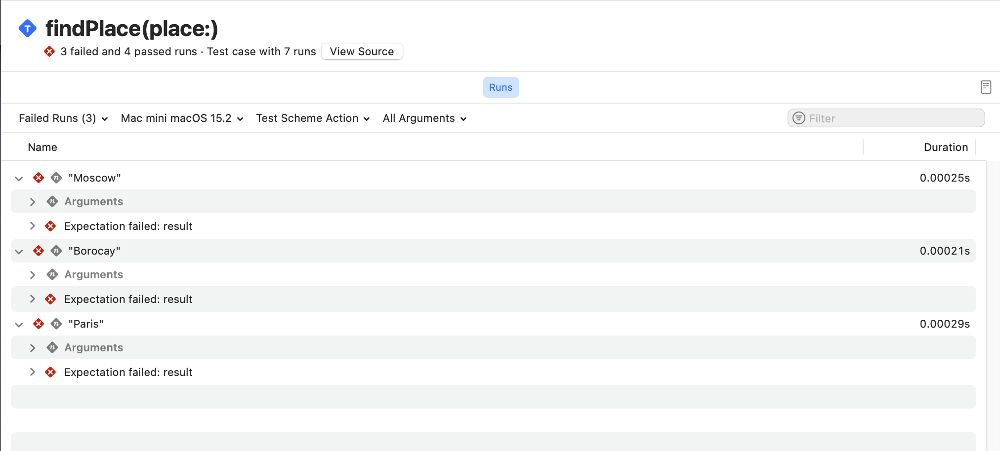
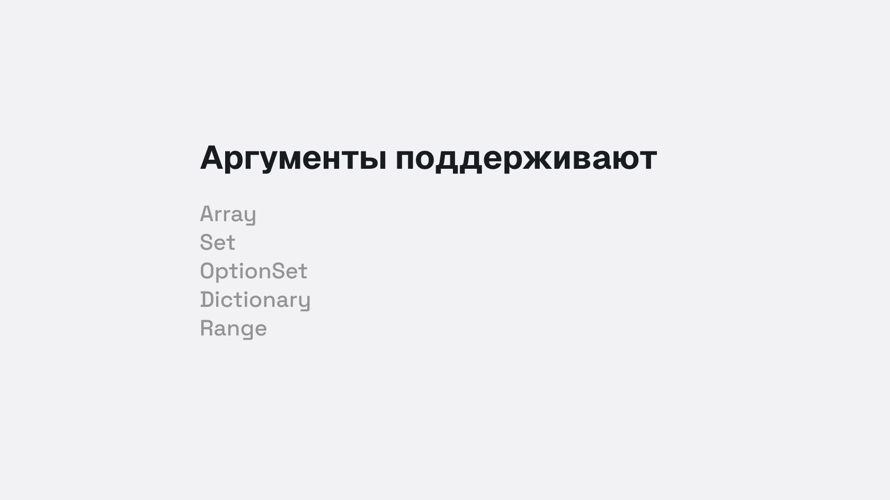

# @Test(...)

Глава про макрос @Test разделена на 4 сценария:

1. [Условие](#Условие-или-runtime-condition)
2. [Общие характеристики или теги](#Общие-характеристики-или-теги)
3. [Запуск с различными аргументами](#Аргументы)
4. [Тонкости успользования](#Тонкости)

Здесь ты столкнешься с распространенными проблемами в тестировании на практике и способы их решени.
Помимо этого, я расскажу о тонкостях работы макроса.<br/>Прочитать о реализации данного макроса можно в главе о [protocol Trait](../protocol_Trait.md).

### Условие или runtime condition

Во-первых, тесты с условием.
Некоторые тесты должны выполняться только при определённых обстоятельствах — например, на конкретных устройствах или в определённом окружении (environments).

Для этого, ты можешь применить трейт условия (`ConditionTrait`) `.enabled(if: ...)`:

```swift
@Test(.enabled(if: Backport.isRemoteVersion))
func backportVersion() async {
	// ...
}
```

Ты передаешь _некоторое_ условие, которое будет оцениваться перед запуском теста и если условие ложно, тест помечается как пропущенный и не выполняется.

> → Test 'backportVersion()' skipped

В других случаях необходимо полностью отключить выполнение теста (чтобы тест никогда не выполнялся). Для этого используй трейт `.disabled(...)`:

```swift
@Test(.disabled("Известный баг, отключаем до фикса #PR-3781"))
func fetchFeatureFlag() async {
  // ...
}
```

> → Test 'fetchFeatureFlag()' skipped: Известный баг, отключаем до фикса #PR-3781

Использование трейта `.disabled(...)` является предпочтительнее комментирования тела функции, поскольку в закомментированном состоянии — тело функции компилируется:

```swift
// Избегайте такого способа отключения теста
@Test("Закомментирую на время фикса #PR-3781")
func fetchAnotherFlag() {
// try await Task(priority: .background) {
//	...
// }
}
```

Тебе может показаться, что одного комментария недостаточно и по-хорошему нужно указать **причину** отключения: баг, ожидание PR (пулл реквеста) или иное условие. Что ж, в дополнение к комментарию ты можешь использовать трейт `.bug(...)`, чтобы явно указать на проблему:

```swift
@Test(
	"Проверка валидности поля именя",
	.disabled("Бекендер исправляет модель"),
	.bug("https://github.com/issue/7329", "Сломанная валидация имени и модель #7329")
)
func validateNameProperty() async throws {
	// ...
}
```

Данный баг будет отображаться в отчете и ты сможешь перейти по ссылке, которая ассоциируется с ним:

![Отчет в Xcode 16][validate_name_property_report]

Когда необходимо запустить тест только на конкретной версии ОС (операционной системы), можешь использовать [атрибут @available(...)][api_availability], чтобы указать на какой версии доступен тест.
Атрибут `@available(...)` позволяет понимать, что у теста есть условие, связанное с версией операционной системы и точнее отражать это в результатах.

```swift
@Test
@available(macOS 15, *)
func usesNewAPIs() {
  // ...
}
```

Избегайте использования проверки доступности с помощью макросов `#available` и `#unavailable`:

```swift
// ❌ Избегайте использования проверки доступности в рантайме с помощью #available и #unavailable
@Test
func hasRuntimeVersionCheck() {
  guard #available(macOS 15, *) else { return }
  // ...
}

// ✅ Используй атрибут @available для функции или метода
@Test
@available(macOS 15, *)
func usesNewAPIs() {
  // ...
}
```



> Атрибут @available(...) используется для обозначения доступности типа данных или функции, а макрос #available используется когда необходимо выполнить часть кода только в определенной версии ОС.

### Общие характеристики или теги

Давай обсудим, как ты можешь объединять тесты, которые имеют общие свойства, даже если они находятся в разных типах данных или файлах.
Swift Testing поддерживает создание пользовательских тегов для тестов.

> [!NOTE]
> Тег (или тэг) — это ключевое слово для обозначения общих свойств в тестах.

В моём проект я уже использовал теги. Найти их можно в навигационном меню Xcode, а именно в Test Navigator снизу.



Чтобы увидеть тесты, к которым применены теги, ты можешь переключиться в новый режим группировки — по тегам.



Давайте применим тег к одному из тестов. Для этого мы добавим трейт `.tags(...)` в атрибут @Test:

```swift
@Test("Сравниваем размер файла", .tags(.fileSize))
func checkSize() {
	let fileSize = Measurement<UnitInformationStorage>(value: 2432, unit: .megabytes)
	
	#expect(fileSize.description == "2.4MB")
}
```

После применения, тег отобразится в Test Navigator под соответствующим тегом.
Я написал еще один тест, который также проверяет размер файла и добавлю его сюда:

```swift
@Test("Сравнение еще одного файла", .tags(.fileSize))
func checkSizeWithFormatter() {
	let fileSize = Measurement<UnitInformationStorage>(value: 2432, unit: .megabytes)
	let filter = Measurement<UnitInformationStorage>.FormatStyle(
		width: .wide,
		locale: .init(identifier: "ru_RU")
	)
	
	let formattedResult = filter.format(fileSize)
	#expect(formattedResult != "2.4 Мегабайта")
}
```
Поскольку оба теста связаны с размером файла, давай сгруппируем их:

```swift
struct AboutFileSize {
	@Test("Сравниваем размер файла", .tags(.fileSize))
	func checkSize() {
		let fileSize = Measurement<UnitInformationStorage>(value: 2432, unit: .megabytes)

		#expect(fileSize.description == "2.4MB")
	}

	@Test("Сравнение еще одного файла", .tags(.fileSize))
	func checkSizeWithFormatter() {
		let fileSize = Measurement<UnitInformationStorage>(value: 2432, unit: .megabytes)
		let filter = Measurement<UnitInformationStorage>.FormatStyle(
			width: .wide,
			locale: .init(identifier: "ru_RU")
		)

		let formattedResult = filter.format(fileSize)
		#expect(formattedResult != "2.4 Мегабайта")
	}
}
```

Теперь мы можешь применить тег `fileSize` к атрибуту @Suite, чтобы тег применялся ко всем тестам в этом типе данных. Поскольку теги применяются ко всем вложенным методам, то можно убрать теги из методов:

```swift
@Suite(.tags(.fileSize))
struct AboutFileSize {
	@Test("Сравниваем размер файла")
	func checkSize() {
    // ...
  }
  // ...
}
```

Ты можешь ассоциировать теги с тестами, которые имеют общие черты. Например, ты можешь применить общий тег ко всем тестам, которые проверяют определенную функцию или вложенный тип данных. Это позволяет запускать все тесты с конкретным тегом, фильтровать их в *Test Report* и даже видеть аналитические данные, например, когда несколько тестов с одним и тем же тегом начинают падать.

Теги могут применяться к тестам в разных файлах, типам данных с атрибутом @Suite и даже использоваться в нескольких таргетах.

При использовании Swift Testing предпочтительнее использовать теги вместо имен тестов для их включения или исключения из тестового плана.

О том, как создать собственный тег [прочитай здесь](macro_tag.md).

### Аргументы

Перед прочтением тонкостей, я бы хотел показать последний процесс связанный с повторением тестов, а именно аргументами.

Предположим, что у тебя есть сервис по достопримечательностям и ты хочешь узнать
информацию о каждом из них:

```swift
struct PlaceService {
	func search(by name: String) async -> Bool {
		let places: [String] = [
			"Gullfoss",
			"Saint Victor",
			"Vestmannaeyjar",
			"Skogafoss",
			"Hong Kong"
		]

		return places.contains(name)
	}
}

@Test
func findPlace() async throws {
	let places: [String] = [
		"Gullfoss",
		"Moscow",
		"Vestmannaeyjar",
		"Skogafoss",
		"Paris",
		"Borocay",
		"Hong Kong"
	]

	let service = PlaceService()

	for place in places {
		let result = await service.search(by: place)
		#expect(result)
	}
}
```



Тест выше работает, однако использование цикла `for` имеет свои недостатки:

1. Ты не можешь видеть результат каждого вызова `#expect(…)` в навигационном меню тестов.
2. Ты не можешь повторно запустить отдельный тест для одного элемента массива.
3. Тесты выполняются последовательно.

Исправим ситуацию и передадим массив в качестве параметра `arguments`:

```swift
@Test(
	arguments: [
		"Gullfoss",
		"Moscow",
		"Vestmannaeyjar",
		"Skogafoss",
		"Paris",
		"Borocay",
		"Hong Kong"
	]
)
func findPlace(place: String) async throws {
	let service = PlaceService()
	let result = await service.search(by: place)
	#expect(result)
}
```

Просто добавь параметр в функцию, избавься от цикла `for`, переместите аргументы в атрибут @Test — и готово!



Параметризованные тесты можно использовать даже в более сложных сценариях, например для тестирования всех комбинаций двух наборов входных данных.



> [!NOTE]
> Слишком большой Range `0 ..< .max` может выполняться очень долго или совсем не завершиться.

### Тонкости

Последний параграф познакомит тебя с особенностями использования макроса `@Test`, которые доступны при детальном чтении исходного кода, который реализует сам макрос. За это отвечает структура данных `TestDeclarationMacro`.

Ты написал много методов и один из них изолирован на `MainActor`.
Поэтому помимо применения атрибута `@Test`, ты можешь применить глобальный актор, чтобы не получить ошибку компиляции на Swift 6:

```swift
@Test("Как определить, функция для теста изолирована на глобальном акторе ?")
@MainActor
func determineGlobalActor() async {
  // ...
}
```

Для выполнения кода и изоляции на глобальном акторе, можно применить глобальный
актор к функции. Если изоляция не нужна для всей функции, то можно изолировать
только определенный код:

```swift
@Test
func executeAtGlobalActor() async {
  await MainActor.run {
    // ...
  }
}
```

Да, разработчики подготовили специальный механизм для определения изоляции и выполнения на `MainActor`. Если ты знаешь как реализовать собственный глобальный актор,
то у меня плохие новости — Swift Testing не умеет определять изоляцию для
кастомных глобальных актор, только `MainActor`.

```swift
lazy var isMainActorIsolated = !functionDecl.attributes(named: "MainActor", inModuleNamed: "_Concurrency").isEmpty
var forwardCall: (ExprSyntax) -> ExprSyntax = {
  "try await Testing.__requiringTry(Testing.__requiringAwait(\($0)))"
}

let forwardInit = forwardCall

if functionDecl.noasyncAttribute != nil {
  if isMainActorIsolated {
    forwardCall = {
      "try await MainActor.run { try Testing.__requiringTry(\($0)) }"
    }
  } else {
    forwardCall = {
      "try { try Testing.__requiringTry(\($0)) }()"
    }
  }
}
```

> [!NOTE]
> Swift Testing умеет определять изоляцию только `MainActor`. Поддержки других глобальных акторов (`@globalActor`) нет.

#### Нет необходимости возвращать тип данных

Если ты внимательно читал код, то обратил внимание что ни одна функция не возвращает конкретный тип данных.
Указание возвращаемого типа данных не является ошибкой, проверка с помощью макросов выполняется, но в этом случае ты получишь предупреждение:

```swift
@Test
func checkReturnType() -> any Collection {
  let collection = Array(1...10)
  #expect(collection.contains(10))

  return collection
}
```

> ⚠️ The result of this function will be discarded during testing

Возможно в будущем, инженеры Apple добавят такую возможность, но на данный момент они не нашли подходящего сценария, при котором необходимо возвращать тип данных.
Такая проверка возможна с помощью проверки сигнатуры возвращаемого типа:

```swift
if let returnType = function.signature.returnClause?.type, !returnType.isVoid {
    diagnostics.append(.returnTypeNotSupported(returnType, on: function, whenUsing: testAttribute))
}
```

#### Неподдерживаемые ключевые слова

На момент выхода книги, в структуре данных [TestDeclarationMacro][test_declaration], которая реализует макрос `@Test`, существуют неподдерживаемые ключевые слова:

```swift
struct TestDeclarationMacro: PeerMacro, Sendable {
    // ...
    // Ключевые слова inout, isolated или _const не поддерживаются.
    for parameter in parameterList {
        let invalidSpecifierKeywords: [TokenKind] = [.keyword(.inout), .keyword(.isolated), .keyword(._const),]
        // ...
    }
}
```

Это легко проверить, создав тест с одним из этих ключевых слов:

```swift
@Test("Проверка не поддерживаемых слов")
func parameterCanBeSupported(value: isolated (any Actor)? = #isolation) {}
```

> ❌ Attribute `Test` cannot be applied to a function with a parameter marked `isolated`

А теперь посмотри на ключевое слово `_const`:

```swift
func withImmutableValue(value: _const String) -> {
  value
}
```

Значения, известные на этапе компиляции (compile-time constant values), — это значения, которые могут быть известны или вычислены во время компиляции и гарантированно не изменяются после её завершения. Использование таких значений может служить различным целям: от обеспечения правил и гарантий безопасности до предоставления пользователям возможности создавать сложные алгоритмы, выполняемые на этапе компиляции.

> [!NOTE]
> Ознакомится более [подробно с _const](https://github.com/swiftlang/swift-evolution/blob/main/proposals/0359-build-time-constant-values.md).

#### Test только для func

Возможно тебе захочется применить атрибут для теста замыкания, но ничего не выйдет. При сборке таргета с тестами, кнопки запуска не появится.
Или иными словам, ты можешь применить атрибут только для функций или методов:

```swift
guard let function = declaration.as(FunctionDeclSyntax.self) else {
    diagnostics.append(.attributeNotSupported(testAttribute, on: declaration))
    return false
}
```

#### 1 атрибут для 1 функции

Да, для кого-то это покажется слишком очевидным, но применить атрибут `@Test` можно только 1 раз:

```swift
let suiteAttributes = function.attributes(named: "Test")

if suiteAttributes.count > 1 {
    diagnostics.append(.multipleAttributesNotSupported(suiteAttributes, on: declaration))
}
```

#### Не приминим для Generics

Атрибуты @Test и @Suite не могут быть применены к дженерикам:

```swift
/// Create a diagnostic message stating that the `@Test` or `@Suite` attribute
/// cannot be applied to a generic declaration.
static func genericDeclarationNotSupported(_ decl: some SyntaxProtocol, whenUsing attribute: AttributeSyntax, becauseOf genericClause: some SyntaxProtocol, on genericDecl: some SyntaxProtocol) -> Self {
  if Syntax(decl) != Syntax(genericDecl), genericDecl.isProtocol((any DeclGroupSyntax).self) {
      return .containingNodeUnsupported(genericDecl, genericBecauseOf: Syntax(genericClause), whenUsing: attribute, on: decl)
  } else {
      // Avoid using a syntax node from a lexical context (it won't have source location information.)
      let syntax = (genericClause.root != decl.root) ? Syntax(decl) : Syntax(genericClause)
      return Self(
      syntax: syntax,
      message: "Attribute \(_macroName(attribute)) cannot be applied to a generic \(_kindString(for: decl))",
      severity: .error
      )
  }
}
```

Получаем ошибку компиляции:

```swift
@Test
func sumOf<V: Numeric>() {
  // ...
}
```

> ❌ Attribute 'Test' cannot be applied to a generic function

[test_declaration]: https://github.com/swiftlang/swift-testing/blob/main/Sources/TestingMacros/TestDeclarationMacro.swift#L84
[validate_name_property_report]: ../assets/validateNameProperty_link.png
[api_availability]: https://docs.swift.org/swift-book/documentation/the-swift-programming-language/controlflow#Checking-API-Availability
