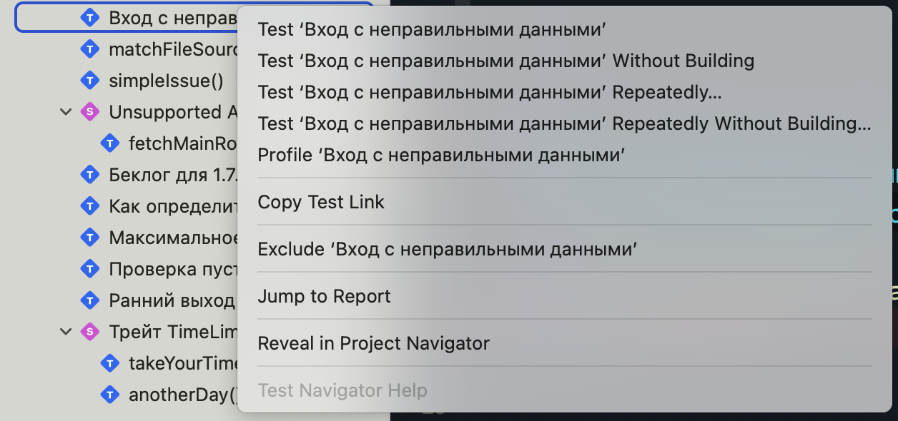
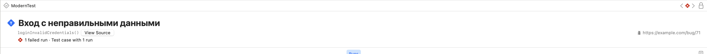
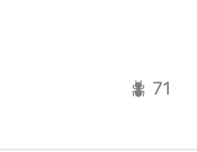
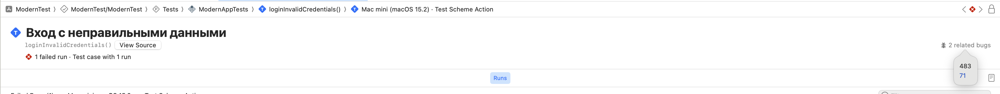

# Баг 🐞

**Баг** — тип данных предоставляющий отчёт о баге.

Тесты позволяют разработчикам доказать, что написанный ими код работает так, как и ожидается. Если код работает неправильно, то используются системы учёта ошибок (баг-трекеры). Устоявшейся практикой считается *прикрепить* ошибку к конкретному тесту, чтобы проверить и/или уточнить статус — баг исправлен или нет.

> [!NOTE]
> Стоит различать баги от ошибок (Issue). Дополнить здесь мысль

### Использование

Для указания на конкретный баг, используй трейт `.bug(...)` в атрибуте @Test:
 
```swift
@Test(
    "Вход с неправильными данными", 
    .bug("https://example.com/bug/71")
)
func loginInvalidCredentials() async {
    let profile = UserProfile()
    await profile.login(option: .singInWithApple)
    #expect(profile.isSuccessLogin)
}
```

В самом простом варианте, ты передаешь ссылку в баг-трекинг:

```swift
.bug("https://example.com/bug/71")
```

Возникает вопрос, как тебе посмотреть информацию о этом баге?<br>
Для начала перейди в отчет тестов, например: как показано на скриншоте <u>Jump to Report</u>.
При переходе в отчет ты увидишь ссылку иконку бага с указанным URL:



В правом вверхнем углу иконка бага и кликабельная ссылка для перехода в баг-трекер.




Помимо ссылки, трейт `.bug(...)` может принимать айди бага:

```swift
@Test(
	"Вход с неправильными данными",
	.bug(id: 71)
)
func loginInvalidCredentials() async {
    // ...
}
```

В таком случае, ты ссылаешь на *айди* бага для баг-трекинга. Кнопка не кликабельна, поскольку мы не указали *URL*.



> Айди (ID) — уникальный признак, позволяющий отличить один объект от другого.

В последнем варианте ты можешь указать айди в дополнение или вместо *URL*:

```swift
@Test(
	"Вход с неправильными данными",
	.bug(id: 483),
	.bug("https://example.com/bug/71", id: 71)
)
func loginInvalidCredentials() async {
    // ...
}
```



> [!NOTE]
> *URL* должен быть передан в качестве строки и соответствовать RFC 3986<a href="#rfc"><sup>[1]</sup></a>.

Однако, одного айди может быть недостаточно для однозначной идентификации бага связанного с тестом, поэтому трейт `.bug(...)` предоставляет еще одно свойство `title`:

```swift
@Test(
	"Вход с неправильными данными",
	.bug(id: 483, "Вход с такими данными невозможен во всех сценариях")
)
func loginInvalidCredentials() async {
    // ...
}
```

> [!TIP]
> Описание бага используется только для программистов и недоступно в отчете, этакая подсказка для себя и/или коллег.

### Централизация багов

Идея централизации багов в баг-трекере отличная, это удобно при работе в одиночку или целой команды, поиск и ведение беседы, ты сам понимаешь преимущества. Возникает вопрос:

> Как централизировать (организовать) баги в коде?

Вместо отдельных *URL* ссылок на баг-трекинг систему, лучшей идей будет использовать централизорованную систему, по аналогии с веб версиями баг-трекеров. Посмотри на пример:

```swift
enum ProfileBugs {
    case createNewOne
    case updateWithInvalidData
    case deleteConfirmation
    case pictureUploadFileSize
    case updateTimeout
    // ...

    var url: String {
        switch self {
            case .createNewOne: "https://example.com/bug/24"
            case .updateWithInvalidData: "https://example.com/bug/71"
            // ...
        }
    }

    var title: String {
        switch self {
            case .createNewOne: "Ошибка при создании профиля"
            case .updateWithInvalidData: "Ошибка при обновлении с невалидными данными"
            // ...
        }
    }
}
```

Данный пример лиш один из множества возможных вариантов организовать баги.
Теперь осталось передать *URL* в инициализатор трейта:

```swift
@Test(.bug(ProfileBugs.createNewOne.url))
func createNewProfile() async {
    // ...
}
```

Как ты догадался, централизованная система делает код более организованным, удобным для поддержки и менее подверженным человеческим ошибкам. Это особенно полезно в проектах с большим количеством тестов.

### Обработка параметров

Библиотека тестирования предоставляет 2 способа обработки параметров:

1. Ссылка (*URL*) предоставляющая больше информации о баге
2. Уникальный идентификатор связанный с баг-трекинг системами

Ты уже ознакомился и знаешь, что трейт `.bug(...)` должен принимать один из указанных выше параметров для корректной обработки библиотекой тестирования. Проверка валидности строки осуществляется в соответсвии RFC 3986 и происходит на этапе компиляции:

```swift
@Test(.bug("com.invalid.domain/id?=63"))
func handleOutput() async {
	// ...
}
```

> ⚠️ URL "com.invalid.domain/id?=63" is invalid and cannot be used with trait 'bug' in attribute 'Test' (from macro 'Test')

В случае, если *URL* не прошел валидацию, ты получишь предупреждение о неправильности строки. Поскольку это предупреждение, сборке и запуску тестов это не мешает.

Другим валидным примером *URL* послужит компания Apple, которая использует внутреннюю систему баг-трекинга, называемой **Radar**:

```swift
@Test(.bug("rdar://16488816"))
func anotherBug() {
    // ...
}
```

Ниже представлена таблица с примера на различные баг-трекинг системы.

<!-- оставить таблицу без форматирования -->

| Трейт | Определяется баг-трекинг системой  |
| ----- | ---------------------------------- |
| `.bug(id: 79262)` | Нет |
| `.bug(id: "79262")` | Нет |
| `.bug("https://www.example.com?id=79262", id: "79262")` | Нет |
| `.bug("https://github.com/swiftlang/swift/issues/79262")` | GitHub Issue |
| `.bug("https://bugs.webkit.org/show_bug.cgi?id=79262")` | WebKit Bugzilla |
| `.bug(id: "FB79262")` | Apple Feedback Assistant |
| `.bug("rdar://79262")` | Apple Internal Bug System |
| `.bug("https://opensource.tbank.ru/")`| T-Bank |

<!--
### Реализация трейта

```swift

```

> _const

Значения, известные на этапе компиляции (compile-time constant values), — это значения, которые могут быть известны или вычислены во время компиляции и гарантированно не изменяются после её завершения. Использование таких значений может служить различным целям: от обеспечения правил и гарантий безопасности до предоставления пользователям возможности создавать сложные алгоритмы, выполняемые на этапе компиляции.

https://github.com/swiftlang/swift-evolution/blob/main/proposals/0359-build-time-constant-values.md

-->
---

<a name="rfc"><sup>[1]</sup>RFC 3986 — это стандарт, который определяет единообразный синтаксис URI (Uniform Resource Identifier)</a>
