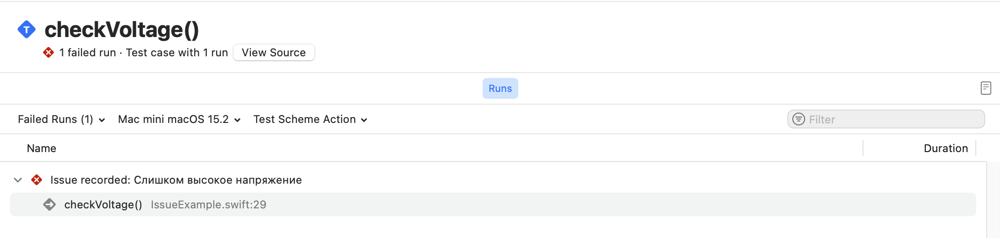

# Проблема (Ишью)

**Ишью** — тип данных отвечающий за показ ошибок или предупреждений в ходе выполнения тестов.

В практическом написании тестов ты столкнешься с ошибками или предупреждениями, которые генерируются с помощью данного типа.

### Явный вызов ишью

Существуют различные ситуации, когда тебе необходимо вручную вызвать ошибку в тесте.
Я бы не сказал, что это распространенная практика, но о таком способе ты должен знать.

```swift
@Test
func checkVoltage() {
	let electricity = ElectricityStation()
	
	guard electricity.highVoltage else {
	  Issue.record("Слишком высокое напряжение")
	  return
	}
}
```

> ❌ Issue recorded ↳ Здесь точно ошибка

В самом простом варианте информация об ошибке записывается, видна в консоли Xcode и выводится в xctestplan.



> [!TIP]
> Существует только 2 уровня проблемы: ошибка и предупреждение
