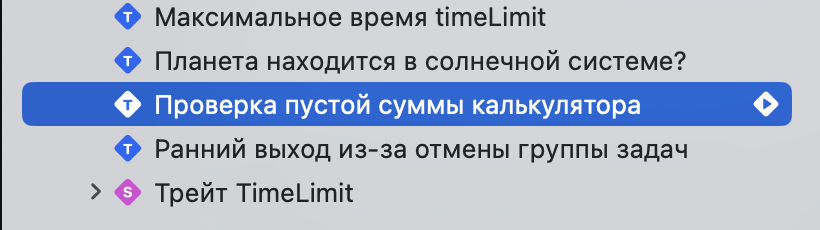

# Базовые макросы сравнения

В этой главе ты изучишь базовые макросы сравнения. Ты можешь использовать проект из этой книги или создать пустой проект, добавив в таргет новую систему тестирования.

Для начала необходимо создать новый проект или добавить таргет в существующий, указав на Swift Testing.


После создания напишем глобальную функцию, импортировав новый фреймворк `Testing`:

```swift
import Testing

@Test
func calculateTotal() { }
```

Данная функция не отличается от обычной swift функции, за исключением добавленного атрибута `@Test`.

> [!NOTE]
> С помощью атрибута `@Test` сообщаем, что функция подлежит тестированию.

Другие условия, когда функция будет тестируемой, помимо атрибута `@Test`:

- Может быть глобальной или быть методом в типе данных
- Может быть асинхронной и помечена как `throws`
- Может быть изолирована глобальным актором (например, `@MainActor`)<a href="#mainActor"><sup>[1]</sup></a>

#### Макрос сравнения #expect

На примере калькулятора импортируем внутренний (`internal`) модуль и фреймворк `Testing`:

```swift
// Мое приложение называется ModernApp
@testable
import ModernApp

import Testing

@Test
func calculateTotal() async {
	let calc = BestCalculator(value: [3, 5, 1])
	await #expect(calc.total == 19)
}
```

> [!NOTE]
> Применив атрибут `@testable` ты получаешь доступ к структурам, классам, акторам и другим данных из этого модуля, даже если их уровень доступа `internal`.

С помощью макроса `#expect()` мы проверяем сумму трех чисел: 3, 5 и 1 и сравниваем её с числом 19.

Получаем ошибку сравнения, поскольку `9 не равно 19`:

> ❌ Expectation failed: (calc.total → 9) == 19

Одна функция не ограничена одной проверкой, поэтому их может быть несколько:

```swift
@Test
func calculateTotal() async {
	let calc = BestCalculator(value: [3, 5, 1])
	
	await #expect(calc.total == 19) // ❌ Expectation failed: (calc.total → 9) == 19
	await #expect(calc.value.isEmpty) // ❌ Expectation failed: (calc.value → [3, 5, 1]).isEmpty → false
	await #expect(type(of: calc.value) == Array<Int>.self) // ✅ Значения калькулятора являются массивом целых чисел
}
```

> [!NOTE]
> Ключевое слово `await` используется для свойства `total`, поскольку `BestCalculator` является актором.

Макрос `#expect` очень гибкий. Ты можешь передать любое выражение, включая асинхронное, оператор сравнения `==`, вызвать свойство `.isEmpty` и т.д.
При неудачном выполнени, результат сравнения будет показан наглядно и нет необходимости использовать сторонние инструменты, чтобы увидеть содержимое массива или его сумму.


Перед тем, как перейти к следующему макросу сравнения, упомяну возможности кастомизации макроса `@Test`.
В чем смысл нового инструмента, если он не решает никаких проблем? Правильно, поэтому ты можешь задать имя для теста:

```swift
@Test("Проверка пустой суммы калькулятора")
func calcWithEmptyValues() async {
	let calc = BestCalculator(value: [])
	await #expect(calc.total == .zero)
}
```

Имя теста можно найти во вкладке навигации тестов (⌘ + 6). Тесты, без заданных имен, обозначаются названием функции.



Помимо кастомизации имени, макрос `@Test` поддерживает другие фичи.
О других возможностях макроса `@Test` [прочитай здесь][link_to_test_macro].

#### Макрос сравнения #require

Иногда необходимо развернуть опциональное значение, закончить выполнение теста заранее и вернуть ошибку. Для этого можем использовать макрос `#require`:

```swift
@Test("Правильная проверка опционального города")
func userHaveCity() async throws {
	let profileData = ProfileData()
	await profileData.getProfile(id: 1)

	let city: String = try #require(profileData.user?.city) // ❌ Expectation failed
	
	#expect(city == "Ísafjörður")
	await profileData.updateUserProfile()
}
```

> ❌ Expectation failed:<br/>profileData.user → UserProfile(id: 1, firstName: "Nick", lastName: "Rossik", email: nil, city: nil).city → nil → nil

Город данного пользователя равен `nil`, поэтому тест завершился неудачей. Код ниже, сравнение города и метод `await profileData.updateUserProfile()` не был выполнен.

<!--
Написать другой пример и показать, почему второе сравнения не имеет смысла, если значение равно nil
-->

Макрос обязательного сравнения (required expectations) схож с предыдущим за исключением 2 деталей:
- `#require` использует ключевое слово `try` и если выражение выкинуло ошибку, то осуществляется ранний выход и тест завершается неудачей.
- помимо этого, `try #require` идеально подходит для получения опционального значения.


> [!TIP]
> `try #require` идеально подходит для получения опционального значения и раннего выхода функции.

Попробуем получить профиль пользователя. Заранее скажу, что при передаче в метод нулевого айди `getProfile(id: .zero)`, пользователь не будет найден
и поэтому вернется `nil`.
Воспользуемся оператором `guard let` и попытается развернуть опциональное значение:

```swift
@Test("❌ Неправильная проверка опционального города")
func userProfileHaveCity() async {
	let profileData = ProfileData()
	await profileData.getProfile(id: .zero)

	// Юзера с айди .zero не существует.
	guard let user = profileData.user else {
		return
	}

	#expect(user.city != nil)
	#expect(user.city == "Moscow")
}
```

Значение `profileData.user` равно `nil` и остальная часть теста зависит от этого свойства.
В результате тест должен был завершиться ошибкой, но этого не происходит. Логика в тесте не верная!

> [!IMPORTANT]
> Старайся использовать `#require` вместо `guard` или `guard let`.


### Организация тестов

При появлении большого кол-ва тестов будет полезным организовать их в группу.
Группа тестов может быть создана одним из 2 способов:

- Разместив функции в тип данных
- Разместив в тип данных и применить атрибут `@Suite`

Тесты, которые ты ранее встречал, были глобальными, т.е. не принадлежали к какому-либо типу данных.
Для организации тестов можем использовать любой тип данных существующий в Swift, например структуру:

```swift
struct UserProfileTest {
	@Test("❌ Неправильная проверка опционального города")
	func userProfileHaveCity() async {}

	@Test("Правильная проверка опционального города")
	func userHaveCity() async throws {}

	// ... другие тесты
}
```

Навигационное меню тестов в Xcode (⌘ + 6) автоматический распознает группировку тестов.
Применение атрибута `@Suite` является необязательным, но с помощью атрибута можно настроить внешний вид тестов, применить различные трейты<a href="#traits"><sup>[2]</sup></a> и другое.
Помимо этого, типы данных могут быть вложены друг в друга:

```swift
@Suite("Тесты юзер профайла")
struct UserProfileTest {
	@Test("❌ Неправильная проверка опционального города")
	func userProfileHaveCity() async {}

	@Test("Правильная проверка опционального города")
	func userHaveCity() async throws {}

	@Suite("Тестирование аватарки")
	enum EmptyCitySearch {
		@Test("Выбор аватарки в профиле")
		func selectProfileAvatar(by query: String) {}
	}
}
```

> Раннее я не упомнял о концепции трейтов для макросов `@Test` и `@Suite`, но чуть позже ты познакомишься с этим понятием.

## Далее

<!-- Может маленький итог и далее ознакомление с макросами? -->

В этой главе ты кратко познакомился с новым фреймворком Swift Testing.
Узнал на практике как использовать новые макросы сравнения и как группировать тесты.

Я знаю, что у тебя осталось много вопросов, по типу:
- «Почему атрибут @Test — это макрос и в чем тут разница» ?
- «Как использовать макросы более продвинуто» ?
- «Кто эти ваши трейты ?

Ответы на эти и другие вопросы содержатся в [следующих главах книги][macros_intro].

---

[macros_intro]: Macros/intro.md
[link_to_test_macro]: Macros/macro_test.md

<a name="mainActor"><sup>[1]</sup>Существуют некоторые ограничения и тонкости при изоляции с глобальным актором.</a>

<a name="traits"><sup>[2]</sup>Трейт (trait, типаж) — это набор методов, определенных для тестов</a>
