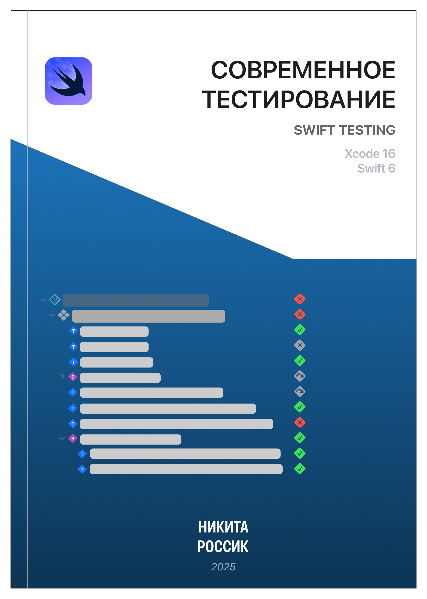

Привет 👋  
Эта книга познакомит тебя с современной системой тестирования _Swift Testing_,  которая пришла на замену _XCTest_.

> [!IMPORTANT]
> `XCTest` — не депрекейтнули, но Swift Testing является более современным и продуманным направлением, избегая классические проблемы и неудобства предшественника.

Данный фреймворк (Swift Testing) нацелен на работу с языком **Swift 6.0** и сокращает запоминание слов начинающихся с **XCT*** до двух макросов, тем самым освобождая ресурсы мозга на более затратные операции. Помимо этого, из коробки присутствует поддержка параллельного вычисления, поддержка структур, акторов, `init`, `deinit` и трейтов (`trait`). Возможно ты не знаком с макросами, но благодаря им инженеры Apple смогли создать такой инструмент.

Материал в книге структурирован и усложнение происходит постепенно, поэтому если ты хотел(а) изучить __современную разработку__ под платформу , то почему бы не начать с __современного способа тестирования__?

Как говориться, [поехали][lets_go]!

[lets_go]: basic_macro.md