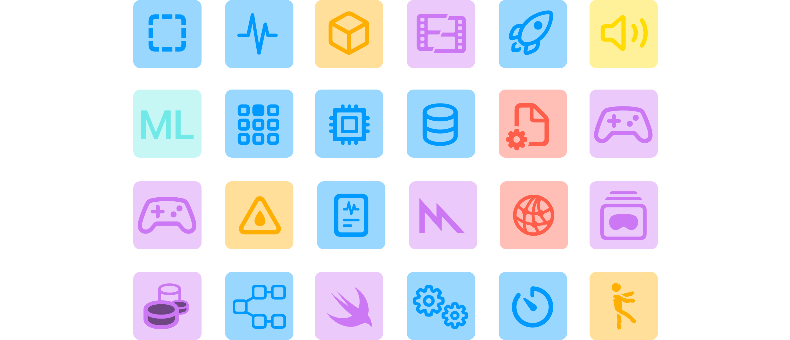

# Почему и когда писать тесты?

В данной главе я не даю четкий ответ на вопрос — «Где и когда нужно писать тесты».
Здесь ты прочтешь размышления, а решение принимай сам.

### Немного определения

**Тест** — это процедура, которая позволяет либо подтвердить, либо опровергнуть работоспособность программы.

### Шаблонный ответ

Зачастую статьи мигрируют из одного сайта во второй, третий и т.д., немного изменяя формулировки, но в конечном итоге ответ являются шаблонным:

1. Тесты помогают предотвратить плохое и сделать все хорошее.
2. Заказчик попросил написать тесты, потому что прочитал статью на сайте и считает, что приложение без тестов — обречено.
3. Или другой классический ответ — если это простая утилита/сервис, то тесты не нужны. А вот в дальнейшем при разростании кодовой базы — тесты крайне необходимы.

Так ли это на самом деле? Является само по себе написание тестов — спасением?
Спасением от багов, от человеческого фактора, от регрессий?
Почему простая утилита не можем быть создана с помощью сложного алгоритма, а все возможные варианты этого алгоритма будет сложно протестировать?

А если тестировать только бизнес логику, а часть ответственности переложить на разработчика бэкенда и QA?

### Усложняем выражение

Каждая переменная вносит сложность в принятии решения — писать тесты для модуля, сделать шаблонные тесты для сетевого слоя, а может ограничиться только тестами бизнес логики?
Позволяет ли текущий проект выделить время для тестов?
А если менеджер проекта вместо с продакт овнером хочет только результат и фичу побыстрее?

Вопросов стало только больше. А что со статистикой?

### Приблизительная статистика

Точных данных нет, это лишь приблизительные цифры.

| Период                             | Средний процент покрытия (приблизительно)               | Комментарии                                                                                                                                                    |
| ---------------------------------- | ------------------------------------------------------- | -------------------------------------------------------------------------------------------------------------------------------------------------------------- |
| **1980-е**                         | <10%                                                    | Покрытие тестами редко измерялось. Основной упор — на ручное тестирование и отладку. Unit testing практически отсутствовало.                                   |
| **2000-е (~20 лет назад)**         | ~20–30%                                                 | С ростом TDD и появлением JUnit/NUnit/SUnit unit-тесты становятся популярнее, но всё ещё не повсеместно.                                                       |
| **2010-е (~10 лет назад)**         | ~30–50%                                                 | Широкое распространение CI/CD, инструменты вроде SonarQube, Xcode Coverage, Istanbul JS. Покрытие стало KPI в некоторых командах.                              |
| **2020-е (~5 лет назад и сейчас)** | ~40% в среднем. ~50–80% в командах финтеха и прочих. | TDD, BDD, автоматизация, тестовые фреймворки интегрированы в процессы. Покрытие стало стандартом качества в agile-командах. Большие разницы между индустриями. |

Ознакомился со статистикой? Сразу возникли вопросы:
1. Почему программы из условных 80-ых были более надежными, если тесты _почти_ не писали?
2. Почему современные программы с покрытием в 60-80% менее надежны?

Может возникнуть ощущение, что таблица не правильная и проценты должны распологаться в обратном порядке: программы из 1980-ых были более надежными, значит покрытием тестов достигало 50-80%.

_Однако это не так_.

> **Основной упор был на правильность работы программы, на бизнес логику, а не на красивые цифры в 80-97%**

Важно помнить:

- **100% покрытие** не всегда оправдано: последние 5–10% могут потребовать непропорционально больше усилий.
- **Высокий процент покрытия ≠ высокому качеству работы программы**: важно не только количество, но и качество тестов. Нет необходимости писать тесты ради тестов или потому что так принято, поэтому и я напишу тоже!

И еще один пример из мира Open Source разработки. Существует 2 мобильных приложения, хранящихся на гитхабе:

1. Первое приложение покрыто тестами на 83%
2. Второе вообще без тестов.

Вопрос с подвохом — у которого их них открыто множество Issue с багами?

### Зачем создавать новый инструмент для тестирования

Простой вопрос — для чего был создан SwiftUI? Зачем?

Ведь UIKit обкатан, стабилен, предсказуем, есть устоявшиеся практики и на нем можно писать еще 20 или 50 лет!

Только не нужно отвечать в стиле «кривая обучения проще, экраны можно проектировать быстрее, соответсвенно MVP можно выпускать быстрее». Это все имеет место быть, но настоящий ответ иной.

**Все дело в том, что мир постоянно меняется.** 

Вместо с ним меняются требования, приходят новые практики, а старые забываются. Мощность компьютеров возрастает, а на современном мобильном телефон можно запустить настольную операционную систему. Условно 10-15 лет назад написать мобильное приложение для Symbian OS было намного проблемнее, чем сейчас создать новый проект в Xcode.

За последние конференции WWDC инженеры из  представили множество различных интрументов для профайлинг SwiftUI, Swift Concurrency и другие.

Именно поэтому текущая библиотека не содержит `UIApplication` метрик. Потому что с помощью новых инструментов ты можешь увидеть скорость вычисления `body`, выявить причину зависания вью и увидеть как работают асинхронные задачи.

Именно эти инструменты позволяют узко «тестировать» конкретные ситуации, будь то частое переключение между главным и кастомным глобальным актором или hang на 2 секунды во вью.

**Тесты эволюционировали.**

> Могли ли инженеры Купертино предоставить возможность тестировать SwiftUI вью?
> Могли!
  
Инженеры из  имеют доступ к приватным фреймворкам, таким как **AttributeGraph**, где можно увидеть:

1. Как создается witness таблица для `SwiftUI._VStackLayout`
2. Как инициализируется `SwiftUI._VariadicView.Tree.init`
3. Как легко можно вызвать методы из `SwiftUI.Tracing` для отладки
4. Увидеть граф вьюх в `SwiftUI.ViewGraph` и вызвать метод `SwiftUI.ViewGraph.beginNextUpdate(at: SwiftUI.Time)`
5. Получить доступ к методу `SwiftUI.ViewRendererHost.updateGraph()` для обновления графа вьюх и т.д.  

Да, могли бы предоставить доступ, чтобы протестировать хранилище `VStack`, узнать есть ли кнопка в ирерархии вью… но этого не случилось.

> **Для этих целей существуют инструменты.**

### Так как же мне поступить?

Тебе хочется сделать упор на техническом качество, а не строгое следование процессу.
Но в реальном мире присутствует непредсказуемость, планы часто меняются, а техническое качество страдает в угоду процессу:

> [!WARNING]
> «Иван! Задачу нужно было сделать еще вчера!»

---

Возможно ты не согласен с мыслями из этой главы полностью. Возможно согласен частично. Так или иначе, у инженеров из  есть своё виденье по части эволюции тестов.

Будь это не так, то Swift Testing предоставлял возможность тестировать акторы, нетруктурированные задачи и вьюхи. Все те возможности, которые поддерживаются в инструментах.
