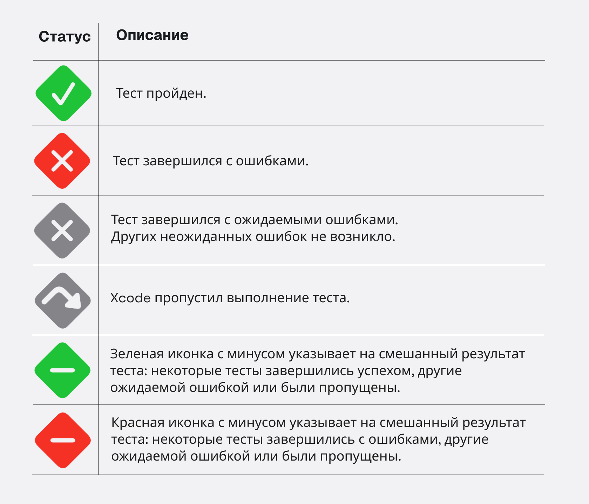
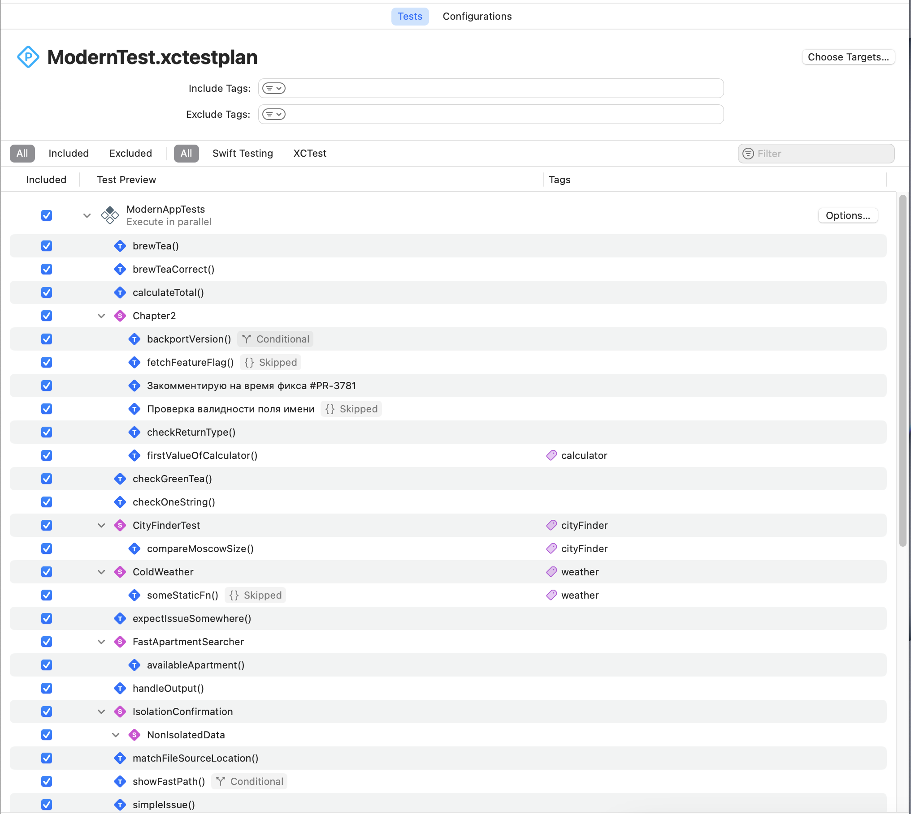

# Метаданные

Финальная глава книги содержит информацию об статусах теста и другие пояснения.

### Анализ результатов тестирования

После выполнения тестов, *Xcode* отображает иконку статуса для каждого теста.
Статус видно в Навигационном меню тестов (⌘ + 6), рядом с самой функцией, а так же в `.xctestplan` файле.

> [!TIP]
> Swift Testing предоставляет функционал, чтобы обозначить какой тест нужно пропустить, а какой должен завершится с ожидаемой ошибкой. Подробнее о [ожидаемой ошибке][known_issue] и [пропуске в тесте][skip_test].

### План тестов *.xctestplan*

Большую часть книги я игнорировал существование плана для тестов (файл с расширением `.xctestplan`), потому что оставляю задачу по ознакомлению для тебя.

В современных проектах *Xcode* предлагает автоматически создать план для теста, в котором ты управляешь всеми созданными тестами, смотришь отчеты и видишь кликабельные ссылки на баги. Надеюсь ты создавал теги, поскольку с ростом количесва тестов бывает полезным отсортировать их.

> [!NOTE]
> В процессе написания книги, я очень часто обращался к плану тестов для просмотра более детальной информации. Надеюсь ты не будешь игнорировать данный файл.

<!-- 
### Выполнение swift test в терминале

Давайте рассмотрим работу Swift Testing в командной строке. Вот простой пакет, который я создал с использованием шаблона New Package в Xcode 16. Мы можем запустить тесты этого пакета из Терминала, введя команду swift test.
Это запускает как тесты XCTest, так и Swift Testing. В консоли отображаются результаты прохождения и сбоев с использованием цветного вывода, а также подробные сообщения об ошибках, аналогичные тем, что показываются в Xcode.
-->

[known_issue]: best_practice_short.md#Ожидаемая-ошибка-withknownissue
[skip_test]: Traits/ConditionTrait.md#Пропустить-выполнение
